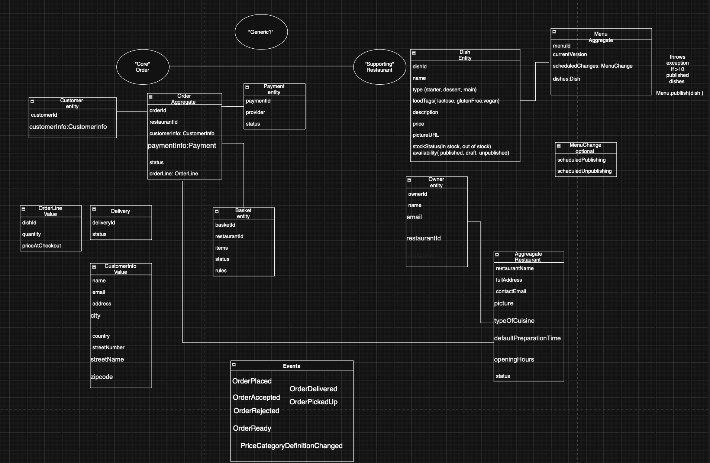
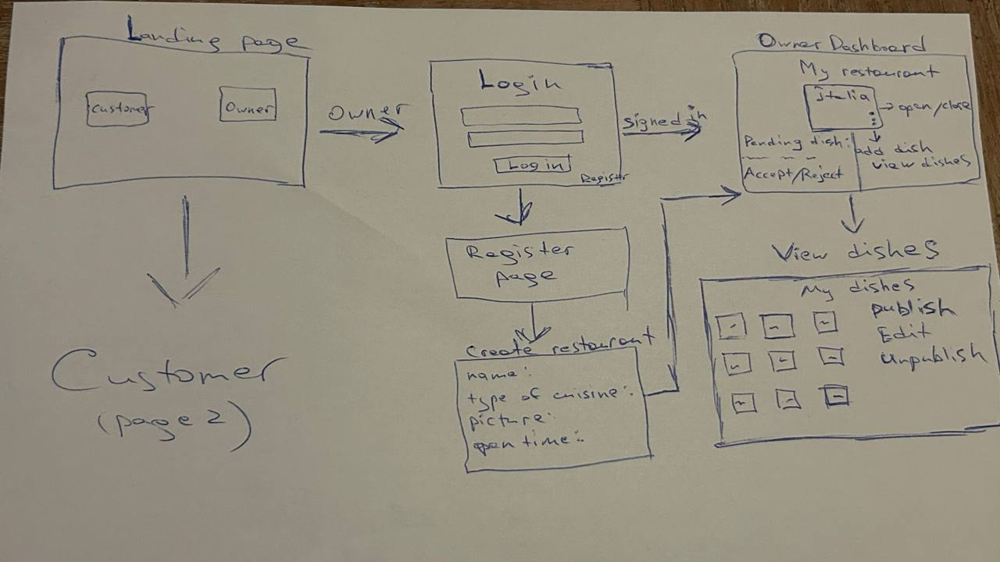

# 🍽️ Keep Dishes Going — Backend

A fine-dining marketplace platform where **restaurant owners manage menus** and **customers explore and order dishes**.  
This is the **Spring Boot backend** built with a **Hexagonal Architecture**, integrated with RabbitMQ, a payment system, and a React + TypeScript + MUI frontend.

---

##  How to Run Locally

-- docker compose up

## To visit RabbitMQ and check messaging:
Go to http://localhost:15672
Login with your RabbitMQ credentials (default: user/password that were set in docker-compose).

## For interaction with Stripe payment system run this in terminal:
- stripe listen --forward-to localhost:8080/webhooks/stripe

1. Clone the repository
   ```bash
   git clone https://gitlab.com/kdg-ti/programming6/students/25-26/chyhohidze-rufina/backend.git
   cd backend


##  Project Overview

The backend handles business logic, authentication, and communication with external systems such as:
- 🧾 Payment provider API
- 📨 RabbitMQ message queue
- 🌐 React frontend via REST API

It enforces clear separation of concerns using **Hexagonal Architecture**, ensuring testability and scalability.

---

##  Architecture

### Hexagonal (Ports & Adapters) Design

**Layers:**

- **Domain Layer** – Core business entities  
  `Dish`, `Restaurant`, `Menu`, `Order`, `Owner`, etc.

- **Application Layer** – Business logic (use cases)
    - `EditDishUseCase`
    - `PublishDishUseCase`
    - `LoadDishByRestaurantUseCase`
    - `ManageOrderUseCase`
    - `PaymentProcessingUseCase`
    - ....

- **Infrastructure Layer** – Persistence, external APIs, messaging
    - JPA Repositories
    - RabbitMQ integration
    - Payment gateway adapter

- **Adapters Layer** – REST controllers and DTOs for frontend communication.

---

##  Initial Domain Model



---

##  Wireframes

Customer and Owner views designed to support both perspectives:




---
- **Menu Logic**
    - Aggregates dishes and validates publishing conditions.
    - Provides filtered dish lists to customers (only published & in-stock).

- **Security**
    - Spring Security with role-based access (for OWNER).
    - JWT authentication and context-based authorization.

- **Messaging**
    - RabbitMQ integration for communication with delivery service:
        - Publishes messages when orders are accepted or ready.
        - Consumes updates on delivery status and courier location.

- **Payments**
    - Integrated an external payment system (custom implementation via self-study).

---

##  Finished Features

Features that were successfully implemented and tested.

- [x] Owner authentication (sign up / sign in)
- [x] Restaurant creation (name, address, contact, cuisine, opening hours)
- [x] Dish management with draft, publish, and unpublish states
- [x] Stock management (mark in/out of stock)
- [x] Manual open/close of restaurants
- [x] Order handling (accept/reject)
- [x] Automatic order rejection after 5 minutes
- [x] Customer restaurant & dish browsing
- [x] Filtering by cuisine, price, distance, and preparation time
- [x] Basket and checkout functionality
- [x] External payment system integration
- [x] RabbitMQ messaging for order delivery updates
- [x] Enforcement of 10-published-dishes limit
- [x] One-restaurant-per-owner rule
- [x] Guest checkout without sign-in

---

##  Unfinished / Planned Features

Features that are planned or partially implemented.

- [ ] Apply all pending dish changes in one action
- [ ] Schedule publishes/unpublishes for a chosen time
- [ ] Provide detailed rejection reasons for orders
- [ ] Mark accepted orders as ready for pickup
- [ ] Show estimated delivery time based on distance & workload
- [ ] Block checkout if a dish becomes unavailable during browsing
- [ ] Send confirmation links to customers for order tracking
- [ ] Implement real-time order status updates
- [ ] View restaurant price range evolution
- [ ] Adjust criteria for price range categories

---

##  Challenges & Accomplishments

### Challenges
- Managing time effectively across many new topics
- Understanding and applying **Hexagonal Architecture**
- Learning **Spring Security** with JWT
- Researching and implementing an external payment system independently
- Frequent refactoring as new requirements were added
- Integrating backend and frontend cleanly
- Adapting to weekly updates and architectural constraints

### Accomplishments
- Implemented majority of core use cases
- Integrated RabbitMQ successfully
- Fully connected backend to frontend
- Implemented and tested external payment system integration
- Achieved solid understanding of Spring Security and JWT
- Gained practical experience with a real-world architecture pattern
- Got familiar with React and full-stack communication
- …and many more lessons learned!

---

##  Technologies Used

- **Java 21 / Spring Boot 3**
- **Spring Web & REST Controllers**
- **Spring Data JPA / Hibernate**
- **Spring Security + JWT**
- **RabbitMQ**
- **PostgreSQL**
- **Maven**
- **External Payment API Integration**
- **Docker (optional for local testing)**

---